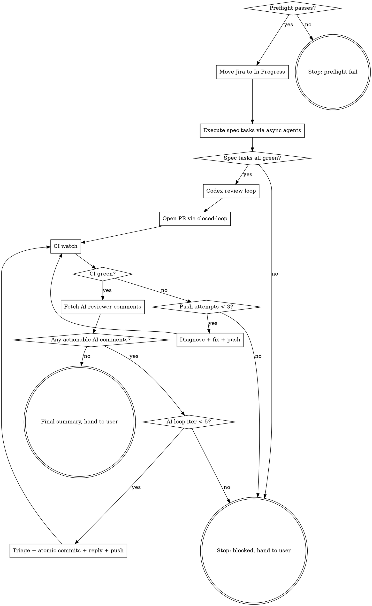

# /g-execute-plan — Spec → atomic commits → green PR (supervised)

## What this skill does

A single orchestrator that drives an approved **spec** from "ready" to "PR is green and review-clean". There is NO separate plan document — the spec (per the /g-brainstorm workflow) is the implementation contract, carrying file paths, interfaces, config keys, enumerated test cases, and acceptance criteria.

1. **Derive tasks from the spec** — one task per component or coherent change, ordered by dependency (clients/helpers → integration points → config → tests → e2e verification). Record with TaskCreate.
2. **Execute each task via an async background agent** — `Agent` tool with `run_in_background: true`, model chosen per the table below. One task → one agent → one atomic commit.
3. **Codex review loop** — runs `/codex-review code` to apply post-implementation fixes as atomic commits.
4. **Jira to In Progress** — via `intuit-closed-loop change-state`. Mandatory before opening a PR.
5. **Open the PR** — via `intuit-closed-loop` (two-phase PR flow). Title must be conventional-commits, ≤72 chars, with the JIRA ID at the end.
6. **Watch the pipeline** — `gh pr checks --watch`. If it fails, diagnose, fix in atomic commits, push, watch again.
7. **AI-reviewer comment loop** — pull bot review comments, triage (agree → fix-and-commit, disagree → reply with reason), push, watch CI again.
8. **Stop** when the PR is green, no actionable AI-reviewer comments remain, and the user has been handed back control.

This skill **never merges and never force-pushes**. It pushes commits and reads CI/comments. Final merge is the user's call.

## Async agent execution model

Every implementation task is dispatched as an **async background agent** (`run_in_background: true`). The orchestrator stays thin: it sequences, verifies, and commits — agents write the code.

**Model per task type** (pass via the Agent tool's `model` param):

| Task type | Model | Examples |
|-----------|-------|----------|
| Trivial / mechanical | `haiku` | config key additions, URL swaps in locale files, renames, boilerplate file scaffolding |
| Standard well-specified implementation | `sonnet` | a new client/helper following an existing pattern the spec names, straightforward unit tests |
| Complex logic, integration, or debugging | omit (inherit session model) | cache/coalescing logic, route-handler wiring on a hot path, diagnosing a failing test |

When unsure between two tiers, pick the higher one.

**Concurrency rules:**

- Tasks that are independent AND touch disjoint files may be dispatched in parallel (multiple async agents in one message).
- Dependent tasks, or tasks touching overlapping files, run strictly one at a time: dispatch → wait for the completion notification → verify → commit → dispatch the next.
- **The orchestrator owns commits.** Agents are instructed to leave changes uncommitted; after each agent completes, the orchestrator reviews the diff, runs cheap checks (typecheck / lint on changed files), and lands exactly one atomic commit per task (via the `commit` skill, JIRA ID included). This prevents interleaved commits from parallel agents.
- Each agent prompt must include: the spec path, the single task's scope ("do ONLY this task"), the relevant spec excerpts, and "do not commit; report what you changed and how you verified it".
- If an agent's result is wrong or incomplete, send a follow-up via SendMessage to the same agent (it keeps its context) rather than spawning a fresh one.

## Iron rules

These exist because each one has burned this workflow before. Violating any one breaks downstream value.

1. **Working tree must be clean at start.** The user's WIP can't be folded into task commits or fix commits.
2. **One commit per logical unit.** Per spec task during execution. Per Codex finding during review. Per AI-reviewer thread during CI cycle. No bundling.
3. **Never `--amend`, `--no-verify`, `git reset --hard`, `git push --force` (or `--force-with-lease`).** A failed hook or check is a real signal — fix it with a new commit.
4. **Jira and PR tooling:** Jira state changes go through the DAST-Orch MCP Jira tools (`transition_issue` etc.); PR creation and all GitHub operations use the `gh` CLI directly. Do NOT use the `intuit-closed-loop` skill — the user has explicitly retired it from this workflow.
5. **PR title format is non-negotiable.** Conventional commits, scope optional, JIRA ID at the end, ≤72 chars total. Example: `fix(auth): enable SSO CPV2-2123`. The CI commitlint check fails at 73+. Detail goes in the PR body, not the title.
6. **Hard caps on every loop:**
   - Spec execution: as many commits as the derived task list has tasks (no creative scope expansion beyond the spec).
   - Codex review: 5 iterations (the `codex-review` skill's own cap).
   - CI auto-fix per push: 3 attempts on the same failure mode.
   - AI-reviewer comment loop: 5 iterations.
7. **Don't ignore disagreement.** If you disagree with a Codex finding or an AI-reviewer comment, mark it disagreed with a one-line reason and reply on the PR thread. Don't silently skip.
8. **Push only after a clean local state.** Commits land, hooks pass, then push. No "push and hope CI does the lint."

## Argument

```
/g-execute-plan [path/to/spec.md]
```

- If a path is given: use that spec file.
- If no path: auto-discover. Look in `docs/superpowers/specs/` for the most recently modified `YYYY-MM-DD-*.md`. If multiple candidates exist or none exists, **stop and ask the user** — guessing the wrong spec is worse than asking.

## Required sub-skills

These MUST be invoked at the marked points; do not reimplement them.

- **codex-review** (`/codex-review code`) — for post-execution code review.
- **commit** — for commit message formatting on every commit this skill makes.
- **superpowers:verification-before-completion** — before claiming any phase is "done".
- **superpowers:test-driven-development** — passed down into agent prompts for implementation tasks that create logic (agents write the failing test first).
- **superpowers:systematic-debugging** — for non-obvious CI or test failures.

## Procedure

### 0. Preflight (once)

Run all checks before touching anything:

- `command -v gh && gh auth status` — gh CLI present and logged in.
- `command -v agent && agent status` — Cursor CLI present and logged in (codex-review needs it).
- `git rev-parse --is-inside-work-tree` — repo.
- `git status --porcelain` — must be empty. If not, **stop**; tell the user to commit/stash first. Do NOT stash for them.
- Resolve spec file (see Argument above). Read it end-to-end so you understand scope.
- Extract or ask for the JIRA ticket ID. Check the branch name, the spec header, and recent commit messages for a `[A-Z][A-Z0-9]+-[0-9]+` pattern (e.g. `CPV2-15484`). If not found, **stop and ask**.
- Confirm current branch is the feature branch, not the base (`master`/`main`/`develop`). If on the base, stop.
- Resolve base branch: `git symbolic-ref --short refs/remotes/origin/HEAD` (strip `origin/`), fallback `master` then `main`.
- Capture `START_SHA="$(git rev-parse HEAD)"` for the final summary.
- **Derive the task list from the spec** (components + config + tests + any multi-repo mechanics the spec defines), record via TaskCreate with dependency order, and assign each task a model tier from the table above.
- **Show the user a one-paragraph plan-of-action** before proceeding: which spec, which Jira, which base, the derived task list with model tiers, expected loops. Give them a chance to abort.

### 1. Move Jira to In Progress

Move the ticket via the DAST-Orch MCP Jira tools (`get_available_transitions` + `transition_issue`) to "In Progress". If the ticket is already in progress, that's fine — no-op and continue. If the call fails, stop and surface the error.

**Verify the transition actually landed** — don't just fire `transition_issue` and assume success. Read the `status`/`statusCategory` back from the transition response (or a follow-up read) and confirm it now shows "In Progress" before moving on. A transition call can return success while the issue is left in a state a downstream gate doesn't recognize.

**JIRA PMC check failing on "ticket is To Do, not In Progress":** this PR check reads Jira state at the time it last ran, not live at PR-open time — if the Jira transition happened after the check's last run (or raced it), the check can be stuck reporting stale state even though the ticket is now correctly "In Progress". Fix order matters:
1. First confirm the Jira ticket is actually "In Progress" (per the verification above). Do not retrigger the check before this is true — retriggering against a still-stale ticket state just reproduces the same failure.
2. Only once the ticket state is confirmed correct, retrigger the check with a double PR-title rename: `gh pr edit <N> --title "<anything-else>"` followed immediately by `gh pr edit <N> --title "<original-title>"`. The rename-back must restore the exact original title (conventional-commits format, JIRA ID, ≤72 chars) — this isn't a cosmetic toggle, it's what forces the check to re-run against current state.
3. Re-check with `gh pr checks <N>` (allow a few seconds for the check to re-run) and confirm Jira PMC is green before proceeding.

### 2. Execute the spec via async agents

For each task in dependency order (parallel only when independent + disjoint files, per the Async agent execution model above):

1. Dispatch an async background agent (`run_in_background: true`, model per the task's tier) with the spec path, the task's exact scope, relevant spec excerpts, the TDD directive for logic tasks, and "do not commit".
2. On the completion notification: review the diff against the spec, run cheap repo-local checks (typecheck, lint on changed files).
3. Land one atomic commit (via the `commit` skill, Conventional Commits with the JIRA ID). Mark the task completed.
4. If the result is wrong/incomplete: SendMessage the same agent with the correction (cap: 2 follow-ups, then take over inline or stop and report).

Do not run the full test suite per task — that's a phase boundary.

When all tasks are done OR a task is blocked:
- If blocked: stop, summarize what's done and what's blocked, hand to user.
- If done: run the project's full test suite once. Failures here are bugs in the implementation — fix them as additional atomic commits before moving on.

### 3. Codex review loop

Invoke the `codex-review` skill with arg `code`. It will run its own iterate-and-fix loop (cap of 5 iterations, atomic commits, disagree-and-skip path, all per its skill). When it returns:
- Note iterations used, findings applied, findings skipped (with reasons).
- If it stopped because the cap hit and there are still actionable findings, **stop the orchestrator** and hand to the user. A non-converging review means the implementation has a deeper issue than fix-and-commit can resolve.

### 4. Final pre-PR checks

- Re-run the full test suite once. All green.
- Run every verification step the spec defines (its acceptance criteria are the definition of done) — invoke `superpowers:verification-before-completion`.
- `git log {BASE}..HEAD --oneline` — sanity-check the commit list reads cleanly. Commits should each describe one thing.
- Confirm the working tree is clean.

### 5. Open the PR

Create the PR with `gh pr create` (base = the resolved base branch). Provide:
- A PR title that follows the format below.
- A PR body that includes: short summary, link to the spec file, the Jira ID, "Codex review iterations: N (M findings applied, K disagreed)", testing checklist, and a "How to verify" section. End the body with the standard Claude Code attribution line.

**PR title rules** (enforced before calling `gh pr create`):

- Format: `<type>(<scope>): <description> <JIRA-ID>`
- `<type>`: one of `feat`, `fix`, `docs`, `chore`, `refactor`, `test`, `style`, `perf`, `ci`, `build`.
- `<scope>` optional, lowercase.
- `<description>` lowercase, no trailing period, present tense.
- JIRA ID at the **end**, uppercase, no brackets, single space before it (e.g. `CPV2-15484`).
- **Total length ≤72 chars.** Count it. If it's 73, trim the scope or the description. Detail goes in the body. CI commitlint will fail at 73+ and you'll be back here anyway.

Pre-flight check before the call:

```bash
TITLE="fix(auth): enable SSO CPV2-2123"
[ "${#TITLE}" -le 72 ] || { echo "PR title too long: ${#TITLE} chars"; exit 1; }
echo "$TITLE" | grep -Eq '^(feat|fix|docs|chore|refactor|test|style|perf|ci|build)(\([a-z0-9_-]+\))?: .+ [A-Z][A-Z0-9]+-[0-9]+$' \
  || { echo "PR title format invalid: $TITLE"; exit 1; }
```

If a PR already exists on this branch (`gh pr view` succeeds), capture the PR number and continue from step 6.

### 6. CI pipeline watch + fix loop

For up to 3 watch iterations after each push:

1. Watch:
   ```bash
   gh pr checks "$PR_NUMBER" --watch --fail-fast
   ```
   This blocks until checks finish (or one fails fast).

2. If all green: continue to step 7.

3. If a check failed:
   - `gh pr checks "$PR_NUMBER"` — list the failing checks.
   - For each failing check, fetch logs:
     ```bash
     gh run view --log-failed --job "$JOB_ID"
     ```
     or, if it's a non-Actions check, follow the `details_url`.
   - Diagnose the actual failure (use **superpowers:systematic-debugging** if it's non-obvious — don't just retry).
   - **Distinguish**:
     - Real failure: fix in code, commit (atomic, conventional, with JIRA ID), push. Non-trivial fixes may be dispatched to an async agent (inherit model) per the execution model above.
     - Flake (test that's known-flaky, network blip in fetch step): re-trigger only the failing check via `gh run rerun --failed --job ...`. Do NOT push an empty commit. Cap: 1 rerun per flake.
     - Infra outage: stop the loop, report to user.
   - Push: `git push` (no force).
   - Loop back to step 1.

4. After 3 push-and-watch iterations on the same failure mode, **stop**. The same failure recurring means deeper investigation is needed; hand to user.

### 7. AI-reviewer comment loop

Once CI is green, fetch PR review comments:

```bash
gh pr view "$PR_NUMBER" --json reviews,comments
gh api "repos/{owner}/{repo}/pulls/$PR_NUMBER/comments"
```

Filter for AI-bot reviewers (e.g. CodeRabbit, Cursor BugBot, Greptile, Coderabbitai, intuit-internal review bots — any login containing `bot`, `[bot]`, `coderabbit`, `cursor`, `greptile`, etc.). Human reviewer comments are **out of scope for this skill** — flag them in the final summary so the user handles them, but do not auto-respond.

For each AI-bot comment:

1. Decide: agree / disagree / defer.
2. **Agree** → make the fix in an atomic commit. Reply on the comment thread with `gh api ... -X POST` linking to the commit SHA: "Fixed in <sha>."
3. **Disagree** → reply on the thread with a one-line reason. Do not just close the thread silently.
4. **Defer** → reply with a brief reason (e.g. "out of scope for this branch; tracking in <JIRA-ID>"). If you don't have a follow-up ticket, ask the user before deferring.

After processing all comments, push, then loop back to step 6 (CI watch). New commits = new pipeline run. **Cap: 5 iterations of (review comments → fix → push → CI watch).** If still not converging, stop and hand to user.

### 8. Final summary

When the loop terminates cleanly, print:

```
g-execute-plan summary
======================
Spec:        <path>
Jira:        <JIRA-ID> (In Progress)
Branch:      <branch>  (base: <base>)
PR:          #<n> <url>  — CI: green
Commits:     <count>  (range: <START_SHA>..HEAD)
Tasks:       <count> executed via async agents (<haiku>/<sonnet>/<inherit> split)
Codex:       <iter> iterations, <applied> applied, <skipped> skipped
AI review:   <iter> iterations, <applied> applied, <skipped> skipped
Human comments outstanding: <list with author + URL>  ← user action needed
```

End with: "Ready for human review / merge. I haven't merged."

## Loop control flow



## Rationalization table

| Excuse | Reality |
|--------|---------|
| "Working tree has unrelated WIP, but I'll work around it." | Don't. WIP gets folded into commits and authorship is destroyed. Make the user commit/stash first. |
| "This task is small, I'll just do it inline instead of an agent." | The async-agent model is the workflow. Inline work hides progress, skips the model-tier decision, and creeps into bundled commits. Dispatch it. |
| "Two agents finished, I'll commit both diffs together." | One commit per task. Interleaved diffs are why the orchestrator owns commits — separate them. |
| "The agent committed by itself, close enough." | Agents are told not to commit. If one did, stop, inspect, and re-land it properly (new commit; never amend/reset). |
| "PR title is 75 chars but it reads better." | CI commitlint fails at 73+. The "better" title fails the pipeline. Trim it. |
| "I'll skip Jira move — the user can do it after." | The workflow contract is Jira In Progress before the PR exists. Move it now via DAST-Orch. |
| "The DAST-Orch Jira tools are erroring, I'll skip Jira." | Transient MCP timeouts happen — retry; if it stays down, stop and surface. Don't proceed PR-first. |
| "CI is failing, just `--no-verify` the next push." | The hook caught a real issue. Bypassing pushes broken code to a remote branch others can see. |
| "Codex finding 4 contradicts finding 2 — pick one." | That's non-convergence. Stop the orchestrator. Don't paper over it. |
| "Bot left 12 nits, I'll bundle into one big fix commit." | One commit per thread. Reviewers (and `git bisect`) need atomic fixes. |
| "Test is flaky, I'll just rerun until it passes." | One rerun per flake, max. If it flakes twice, treat it as a real failure. |
| "Force-push will tidy the history before review." | Never force-push from this skill. History stays append-only. |
| "Human reviewer left a comment, I'll just answer it too." | Out of scope. Surface to user. Auto-responding to humans is presumptuous. |
| "I'll batch the Codex pass and the AI-reviewer pass into one push." | They're different phases with different commit framings. Push between them. |
| "PR is green and bot has no comments — I'll go ahead and merge." | Never. Merge is the user's decision. |

## Red flags — STOP and reset

- About to use `--amend`, `--no-verify`, `--force` / `--force-with-lease`, or `git reset --hard`.
- About to implement a spec task inline instead of dispatching an async agent.
- About to run two agents in parallel on overlapping files without worktree isolation.
- About to skip the Jira state move.
- About to push a PR title >72 chars or without a JIRA ID.
- About to merge.
- About to bundle multiple tasks, findings, or comments into one commit.
- About to silently skip a Codex finding or AI-reviewer comment without recording a reason.
- About to stash the user's uncommitted work for them.
- About to enter the 4th CI auto-fix iteration on the same failure.
- About to enter the 6th AI-reviewer-comment iteration.
- About to auto-respond to a human reviewer's comment.

**All of these mean: stop the orchestrator, surface state to the user, let them decide.**

## Quick reference

```bash
# Preflight
gh auth status && agent status
git status --porcelain  # must be empty
BASE="$(git symbolic-ref --short refs/remotes/origin/HEAD 2>/dev/null || echo origin/master)"
BRANCH="$(git rev-parse --abbrev-ref HEAD)"
JIRA_ID="$(echo "$BRANCH" | grep -oE '[A-Z][A-Z0-9]+-[0-9]+')"  # fallback: spec header, recent commits

# PR title check
TITLE="fix(auth): enable SSO ${JIRA_ID}"
[ "${#TITLE}" -le 72 ] && echo "$TITLE" | grep -Eq '^(feat|fix|docs|chore|refactor|test|style|perf|ci|build)(\([a-z0-9_-]+\))?: .+ [A-Z][A-Z0-9]+-[0-9]+$'

# CI watch
gh pr checks "$PR_NUMBER" --watch --fail-fast

# Pull AI-reviewer comments
gh api "repos/{owner}/{repo}/pulls/$PR_NUMBER/comments" \
  --jq '.[] | select(.user.login | test("bot|coderabbit|cursor|greptile"; "i"))'

# Reply on a thread
gh api "repos/{owner}/{repo}/pulls/$PR_NUMBER/comments/$COMMENT_ID/replies" \
  -X POST -f body="Fixed in $(git rev-parse HEAD)."
```

## Common mistakes

- **Auto-discovering the wrong spec.** Multiple specs in `docs/superpowers/specs/`? Ask. Don't guess.
- **Doing tasks inline "because they're quick".** Every implementation task goes through an async agent with a deliberate model tier. The orchestrator only sequences, verifies, and commits.
- **Letting agents commit.** Commit ownership belongs to the orchestrator — that's what keeps one-commit-per-task true under parallelism.
- **Forgetting to push between phases.** Local commits don't trigger CI. Push at the boundaries.
- **Treating a 73-char PR title as "close enough".** It isn't — commitlint fails.
- **Auto-responding to human reviewers.** Out of scope. Surface to the user.
- **Letting the AI-reviewer loop run forever.** Cap is 5. After that, the bot is finding new "issues" each iteration, which means the bot's threshold is wrong for this PR — escalate to user.
- **Mixing Codex-fix commits with task-execution commits.** Different phases, different commit framings, different push boundaries.
- **Force-pushing to "clean up" before review.** Never. The history this skill produces is the audit trail of how the PR got built.
