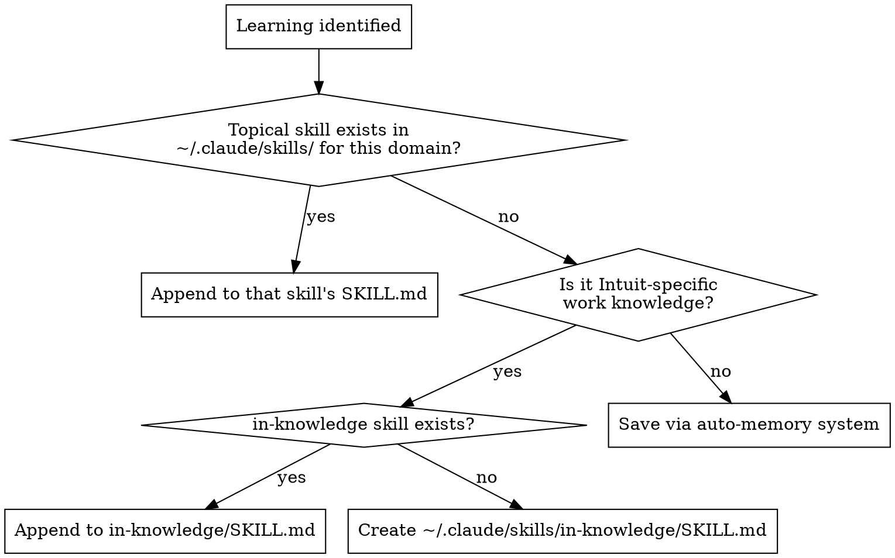

# Learn

Captures one reusable learning from the current session and routes it to
the right home, so future sessions don't rediscover it from scratch.

## When to use

- User runs `/learn` (with or without argument text describing the learning).
- Proactively, when something non-obvious surfaces mid-session that would
  help a future session: a root-cause fix, a tool quirk, a domain fact,
  a corrected assumption. Same bar as auto-memory's feedback/project types
  — don't fire for things already obvious from reading the code.

Only capture ONE learning per invocation. If several surfaced, run this
once per learning, or pick the most reusable one and ask.

## Routing (check in this order)



### Step 1 — Search for a topical skill

List `~/.claude/skills/` (resolve symlinks) and check each `SKILL.md`
frontmatter `description` against the learning's subject matter — same
matching judgment used for any other skill lookup. A "topical skill"
means one whose _subject_ is the domain the learning is about (e.g. a
skill about a specific car's diagnostics, a specific service, a specific
recurring research playbook). A skill that merely _uses_ something as one
step of a broader workflow does not count — e.g. `g-prepare` creates Jira
tickets as a step, but a learning about a Jira custom-field quirk is not
"topical" to it; that falls through to Step 2/3. Generic process skills
(`commit`, `wrap`, `plan`) never count as topical matches.

If found: append the learning as a new bullet/section in that skill's
`SKILL.md`, matching its existing structure. Don't restructure the rest
of the file.

### Step 2 — in-knowledge fallback

If no topical skill matches, and the learning is Intuit-specific (internal
tools, internal systems, internal process, work-domain knowledge tied to
Intuit rather than this user's personal projects):

- If `~/.claude/skills/in-knowledge/SKILL.md` exists, append the
  learning there under the matching topic heading (see grouping rule
  below), following its existing structure.
- If it doesn't exist yet, create it with minimal frontmatter:

```markdown
---
name: in-knowledge
description: Use when working on Intuit-internal tools, systems, or processes and general institutional knowledge would help — accumulated learnings not specific to any single tool or service.
---

# Intuit Knowledge

Accumulated learnings about Intuit-internal tools, systems, and processes,
captured via the `learn` skill.

## <Topic>

- <learning>
```

Group entries under a `## <Topic>` heading named for the system/tool the
learning is about (e.g. `## Jira`, `## Splunk access`, `## GHES`) — one
heading per topic, not per date or per session. Append a new bullet under
an existing heading if one already matches; only add a new heading when
none fits.

### Step 3 — Memory fallback

If neither applies (not Intuit-specific, no topical skill fits), save it
using the auto-memory system exactly as documented in the environment's
memory instructions: a frontmatter file under the current project's
`memory/` directory, plus a one-line pointer in that directory's
`MEMORY.md`, using whichever of the four types (user/feedback/project/
reference) fits. Follow the memory instructions' own frontmatter format —
don't invent a schema; if unsure, match the newest-dated existing file
under `memory/` in this project.

Before writing, dedup: grep `MEMORY.md`'s one-line entries for keywords
from the learning. If a line looks related, open that memory file and
either update it in place (if the learning refines or corrects it) or
skip writing (if it's already covered) — don't create a second file for
the same fact.

## After saving

Report back in one line: where it went and why, e.g.:

> Saved to `skills/in-cp-research` (topical match) — ...
> Saved to `skills/in-knowledge` (new section, Intuit-specific, no topical skill) — ...
> Saved to memory (`feedback_x.md`) — not Intuit-specific, no topical skill — ...

## Common mistakes

- Treating a generic process skill (commit, wrap, plan) as a "topical
  match" for an unrelated learning — it isn't; fall through to the next
  step.
- Writing the learning into a topical skill in narrative form ("in this
  session we found..."). Convert it to a reusable statement first.
- Skipping the memory dedup check and creating a second memory file for
  the same fact.
